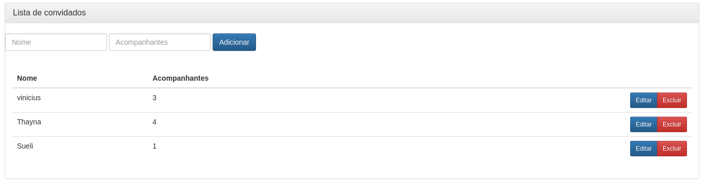

# gestao-festa
Projeto base com spring
---
Sistema com CRUD básico para conhecer o framework spring, utlizando o Spring Boot, Spring MVC, Spring Data JPA, Spring Security, Thymeleaf, Spring Tool Suite, Bootstrap e Mysql.

---
Projeto feito seguindo a de datida do livro (Desenvolvimento Web com Spring Boot) do autor Alexandre Afonso.

| Preview |
| ------- |

||